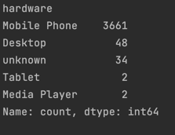

# Отчет по задаче

## Решение ML стеком

Результаты можно посмотреть в ctr.ipynb

Для предсказания ctr использовались модели Catboost, LightGBM.

Обработка данных производится функцией preprocessing из скрипта ml/preprocessing.py

## Решение с помощью LLM

В качестве LLM использовалась GPT4all (в отличие от рекомендуемых в задании GPT 4, она бесплатна, 
и в отличие от Bard поддерживается langchain. Более того, это open-source модель).

Большая проблема, что эта модель не генерирует код и отвечает на вопросы значительно хуже чем GPT4, 
но решение можно легко адаптировать под GPT-4 и получить намного лучшие результаты (однако у меня нет подписки на GPT-4).

Используется отпрепроцешенный датасет, которого нет в гите, так как его размер больше 100 МБ.

### Краткое описание файлов:

В скрипте agent реализована основная часть пайплайна. 

В скрипте templates содержатся контексты для пользовательских промптов.

В скрипте examples лежат примеры для few-shot learning (пока готов только 1 пример).

Сгенерированный код для ответов на промпты лежит в папке generated_code.

### Что еще можно сделать

1) Так как использованная здесь GPT4all - это open-source модель, то здесь можно применить prompt-tuning. 
Для этого придется прописать хотя бы пару десятков примеров, заморозить все веса кроме эмбеддингов 
и обучиться получать эмбеддинги промптов, которые дадут лучшие результаты.

2) Использовать autogpt для автоматической декомпозиции задания в скрипте.

3) Сделать более качественные примеры для few-shot learning с использованием ООП.

## Результаты

Для промптов с написанием кода использовался Agent из agentGPT4

Ниже приводятся результаты запуска сгенерированного кода для нескольких промптов:

### Which types of devices get the most ad clicks, ranked from highest to lowest

(код в файле generated_code/Which types of devic.py)

Результат получается подсчитанным верно

### Build a model to predict ad click probabilities

(код в файле generated_code/Build a model to pre.py)

При построении модели для предсказания клика LLM учла примеры и обучила LightGBM 
(без few-shot примеров LLM выбирала логистическую регрессию)

LLM получила лог лосс чуть лучше чем при ML решении. Однако код предложенный LLM использовал site id, что плохо влияет на обобщающую способность модели.
В моем коде эта фича не использовалась сознательно.

Log Loss (LLM) = 0.4314

Log Loss (ML) = 0.4338

### аналитические опросы без кода 

Использовался SimpleCSVAgent (LLM/csv_agent). Примеры сгенерированных ответов лежат в папке SimpleAgentCode

Вот пример ответа на вопрос

Which types of devices get the most ad clicks, ranked from highest to lowest

The types of devices that get the most ad clicks, ranked from highest to lowest, are:

1. Mobile Phone: 3661 clicks
2. Desktop: 48 clicks
3. Unknown: 34 clicks
4. Media Player: 2 clicks
5. Tablet: 2 clicks
6. Mobile+Phone: 0 clicks

Этот ответ совпадает с результатом запуска groupby

